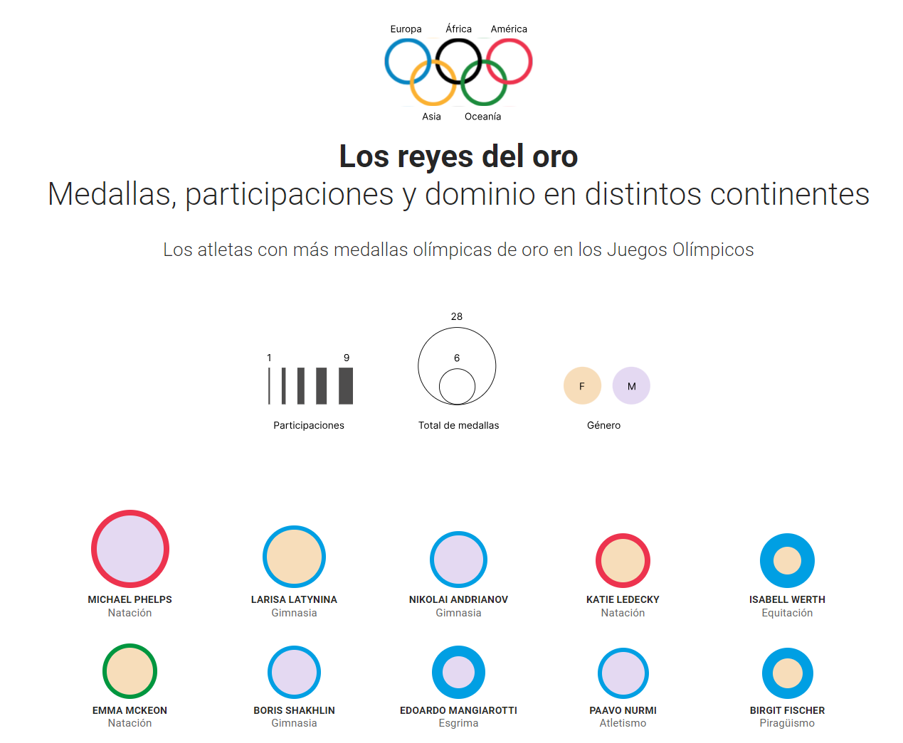
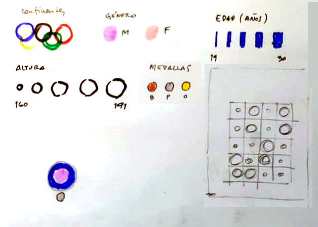
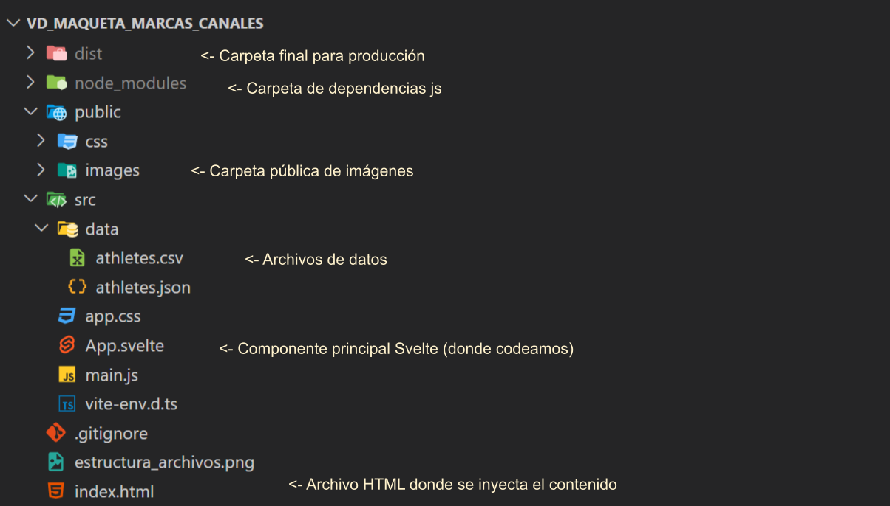

# VD | Maqueta marcas y canales

### Visualización de datos de medallistas olímpicos (HTML, CSS, D3 y Svelte)

---




### Datos
```bash
| src
| -- data
| ---- athletes.csv
| ---- athletes.json
```

## Boceto


Referencias: [Escalas de d3.js](https://d3js.org/d3-scale)

---

## Estructura de archivos:



## Requerimientos:

- [Node.js](https://nodejs.org/es/) version 18+

## Dependencias:
Ejecutar el siguiente comando para instalar las dependencias del proyecto:
```bash	
npm install
```

## Desarrollo:
Ejecutar el siguiente comando para iniciar el servidor de desarrollo que generará un servidor local y recargará el navegador automáticamente. Hacer click sobre la url que se muestra en la consola para abrir el navegador.

```bash	
npm run dev
```

## Build :
Ejecutar el siguiente comando para generar los archivos de producción (html, css, js y assets) en la carpeta `dist`:
```bash	
npm run dev
```

  


# Guía Detallada


### Introducción


Esta guía explica paso a paso cómo crear una visualización de datos interactiva que muestra información sobre deportistas olímpicos. El proyecto combina Svelte, un framework moderno de JavaScript, con D3.js, una potente biblioteca para visualización de datos.

### 1. Fundamentos del Proyecto

#### ¿Qué vamos a crear?

- Una visualización donde cada atleta olímpico está representado por un círculo

- Los círculos varían en tamaño, color y grosor del borde según los datos del atleta

- La visualización es interactiva y responsiva

#### Tecnologías utilizadas

- **Svelte**: Framework de JavaScript para construir interfaces de usuario

- **D3.js**: Biblioteca para crear visualizaciones de datos

- **CSS**: Para estilos y layout

- **HTML**: Estructura básica del documento

### 2. Estructura del Código


#### Importaciones Explicadas

```javascript

import * as d3 from "d3"

import atletas from "/src/data/athletes.csv"

```

**¿Qué hace cada importación?**

- `import * as d3`: Importa todas las funcionalidades de D3.js. El `*` significa que importamos todo el paquete.

- `import atletas`: Importa nuestros datos desde un archivo CSV. Los datos contienen información como:

  - Nombre del atleta

  - Número de medallas

  - Número de participaciones

  - Género

  - Continente de origen

### 3. Escalas D3.js

#### a. Escala para Participaciones

```javascript

const minMaxParticipations = d3.extent(atletas, (d) => d.participations)

let grosorPartic = d3.scaleLinear()

  .domain(minMaxParticipations)

  .range([2, 18])

```

**Explicación detallada:**

1. `d3.extent()`: 

   - Esta función encuentra los valores mínimo y máximo en nuestros datos

   - Recibe dos argumentos:

     - El array de datos (`atletas`)

     - Una función que indica qué propiedad queremos evaluar (`d.participations`)

   - Retorna un array: `[mínimo, máximo]`

2. `scaleLinear()`:

   - Crea una función de escala lineal

   - `.domain()`: Define el rango de entrada (mínimo y máximo de participaciones)

   - `.range()`: Define el rango de salida (grosor del borde en píxeles)

   - Por ejemplo:

     - Si un atleta tiene el mínimo de participaciones → borde de 2px

     - Si tiene el máximo → borde de 18px

     - Los valores intermedios se calculan proporcionalmente

#### b. Escala para Medallas 
```javascript

const maxMedallas = d3.max(atletas, (d) => d.medallas)

const diamMedallas = d3.scaleRadial()

  .domain([0, maxMedallas])

  .range([0, 100])

```

**¿Por qué usamos una escala radial?**

- La escala radial es perfecta para representar áreas circulares

- Mantiene la proporcionalidad visual entre el número de medallas y el área del círculo

- A diferencia de una escala lineal, la escala radial considera el área total del círculo

**Ejemplo práctico:**

- Si un atleta tiene 0 medallas → círculo de 0px de diámetro

- Si tiene el máximo de medallas → círculo de 100px de diámetro

- Los valores intermedios se escalan proporcionalmente

#### c. Escala para Género 
```javascript

const colorGenero = d3.scaleOrdinal()

  .domain(["F", "M"])

  .range(["#F7DDBA", "#E4D9F2"])

```

**¿Por qué una escala ordinal?**

- Las escalas ordinales son perfectas para datos categóricos (como el género)

- Asignan un valor específico a cada categoría

- En este caso:

  - "F" (Femenino) → Color beige suave (#F7DDBA)

  - "M" (Masculino) → Color lavanda suave (#E4D9F2)

**Elección de colores:**

- Se eligieron colores suaves para no competir visualmente con los bordes

- Los colores tienen un contraste suficiente para ser distinguibles

- Mantienen una armonía visual con el diseño general

#### d. Escala para Continentes (Detallada)

```javascript

const colorContinentes = d3.scaleOrdinal()

  .domain(["América", "África", "Asia", "Europa", "Oceanía"])

  .range(["#ed334e", "#000000", "#fbb132", "#009fe3", "#00963f"])

```

**Significado de los colores:**

- América: Rojo (#ed334e) - Representa energía y pasión

- África: Negro (#000000) - Color de fortaleza y poder

- Asia: Amarillo (#fbb132) - Simboliza sabiduría y tradición

- Europa: Azul (#009fe3) - Color de estabilidad y unión

- Oceanía: Verde (#00963f) - Representa crecimiento y naturaleza

### 4. Estructura del Markup 

```html

<main>

  <div class="header">

    <!-- Sección de cabecera -->

    

    <h3 class="headline">

      <b>Los reyes del oro</b>

      Medallas, participaciones y dominio en distintos continentes

    </h3>

  </div>

  <div class="container">

    {#each atletas as atleta}

      <div class="person-container">

        <div class="person" 

          style="

            border-color: {colorContinentes(atleta.continent)};

            background-color: {colorGenero(atleta.gender)}; 

            width: {diamMedallas(atleta.medallas)}px; 

            height: {diamMedallas(atleta.medallas)}px; 

            border-width: {grosorPartic(atleta.participations)}px; 

          ">

        </div>

      </div>

    {/each}

  </div>

</main>

```

**Análisis del markup:**

1. **Estructura general:**

   - `<main>`: Contenedor principal

   - `.header`: Sección de título y referencias

   - `.container`: Contenedor de la visualización

2. **Directiva each de Svelte:**

   - `{#each atletas as atleta}`: Itera sobre cada atleta en nuestros datos

   - Crea un elemento visual por cada atleta

3. **Estilos dinámicos:**

   - `border-color`: Color según el continente

   - `background-color`: Color según el género

   - `width` y `height`: Tamaño según número de medallas

   - `border-width`: Grosor según participaciones

### 5. Estilos CSS

```css

.container {

  display: flex;

  justify-content: center;

  align-items: end;

  margin: auto;

  flex-wrap: wrap;

  max-width: 1020px;

  gap: 30px;

  margin-bottom: 100px;

}

```

**Explicación detallada de las propiedades:**

- `display: flex`: Crea un contenedor flexible

- `justify-content: center`: Centra los elementos horizontalmente

- `align-items: end`: Alinea los elementos en la parte inferior

- `flex-wrap: wrap`: Permite que los elementos se envuelvan en múltiples líneas

- `max-width: 1020px`: Limita el ancho máximo para mejor legibilidad

- `gap: 30px`: Espacio entre elementos

```css

.person {

  border-radius: 50%;

  box-sizing: border-box;

}

```

**¿Por qué estas propiedades?**

- `border-radius: 50%`: Crea la forma circular

- `box-sizing: border-box`: Incluye el borde en el tamaño total


